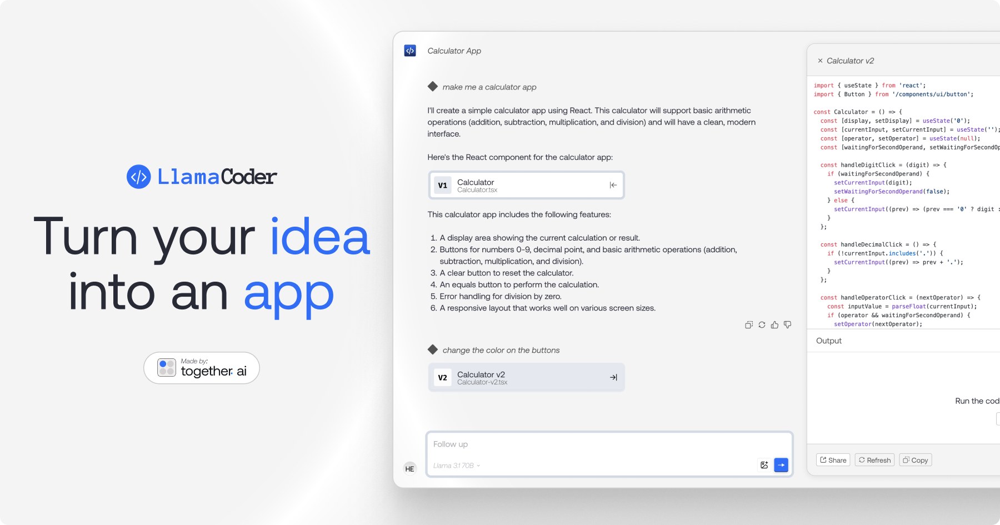

<a href="https://www.llamacoder.io">
  
  <h1 align="center">Llama Coder</h1>
</a>

<p align="center">
  An open source Claude Artifacts – generate small apps with one prompt. Powered by Llama 3 on Together.ai.
</p>

## Tech stack

- [Llama 3.1 405B](https://ai.meta.com/blog/meta-llama-3-1/) from Meta for the LLM
- [Together AI](https://togetherai.link/?utm_source=llamacoder&utm_medium=referral&utm_campaign=example-app) for LLM inference
- [Sandpack](https://sandpack.codesandbox.io/) for the code sandbox
- Next.js app router with Tailwind
- Helicone for observability
- Plausible for website analytics

## Cloning & running

1. Clone the repo: `git clone https://github.com/Nutlope/llamacoder`
2. Create a `.env` file and add your [Together AI API key](https://togetherai.link/?utm_source=llamacoder&utm_medium=referral&utm_campaign=example-app): `TOGETHER_API_KEY=`
3. Run `npm install` and `npm run dev` to install dependencies and run locally

## GitHub OAuth Setup

To enable the GitHub export feature, you need to create a GitHub OAuth App:

1. Go to https://github.com/settings/applications/new
2. Fill in the application details:
   - Application name: `LlamaCoder` (or your preferred name)
   - Homepage URL: `http://localhost:3000` (for development)
   - Authorization callback URL: `http://localhost:3000/api/auth/github/callback`
3. Click "Register application"
4. Copy the Client ID and Client Secret
5. Create a `.env.local` file in the root directory:
   ```
   GITHUB_CLIENT_ID=your_client_id_here
   GITHUB_CLIENT_SECRET=your_client_secret_here
   NEXTAUTH_URL=http://localhost:3000
   ```

For production deployment, update the URLs to match your domain.

## Features

- Generate React components with TypeScript types from plain English prompts
- Export components to GitHub with a single click
- Edit components in your favorite code editor
- Instant live preview of components
- Fully customizable app metadata and theme
- Dark mode support
- Built-in authentication with GitHub
- Server-side rendering and static site generation
- API routes for backend logic
- Environment variable support
- TypeScript support
- ESLint and Prettier configuration
- Commitizen and semantic release for versioning
- GitHub Actions for CI/CD
- Dockerfile and docker-compose.yml for containerization
- Vercel and Netlify deployment scripts
- Comprehensive documentation and examples
